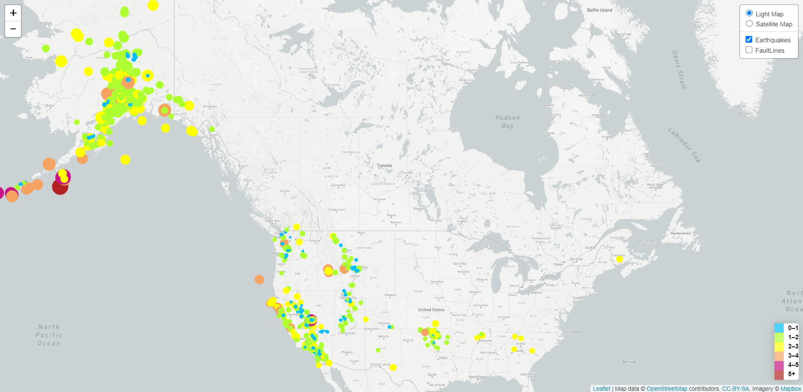
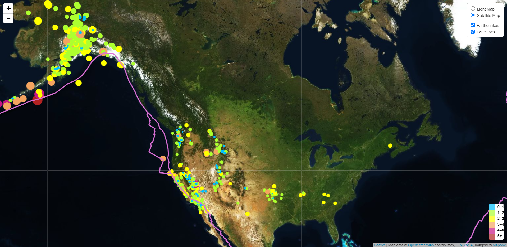

# Leaflet-Challenge
Click here to see Webpage: (https://tnatoli29.github.io/Leaflet-Challenge/)

Using Leaflet and Mapbox API to generate a world map and show where earthquakes from the previous week. 
The size and color of the circle represent the magnitude of the earthquake. 
There is also a toggle button to show a light map verse the satellite as well as the faultlines for the world.

Below are the images of the light map and the satellite map with the fault lines.

